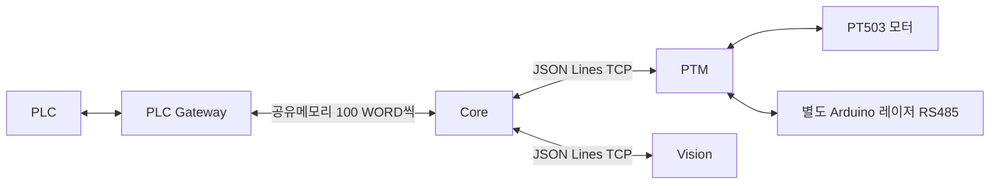

# Core / PLC / PTM / Vision 운전 점검

점검일: 2026-10-09. 대상: Windows 11 x64, Linux RDK X5 3.5 이미지.

Core·Gateway·PTM 코드를 수정했다. Vision 저장소의 코드와 설정은 변경하지 않았다. Vision은 현재 진단 결과를 제공하며 생산 승인과 각도 오차를 제공하지 않아, 통신이 정상이어도 위치 OK 및 레이저 목표 준비 조건을 만족할 수 없다. 수정 방향은 [Vision 연동 지침](VISION_INTEGRATION_GUIDE.md)을 따른다.

## 구성과 설정 책임

- Gateway: PLC IP·포트·읽기/쓰기 주소·크기·주기와 공유메모리 생성/소유.
- PTM: 모터·레이저 시리얼, 레시피, 이동 도착 판단, 원점복귀 완료 상태.
- Core: 서버 연결 주소, 실행 스크립트, 프로세스 관리, PLC 명령/상태, 운전 인터록.
- Vision: 카메라와 검사·추적 결과. 이번 작업에서는 수정 지침만 작성.

Core는 Gateway의 `get_config`를 시작/설정 적용 때와 운전 중 약 2초 간격으로 조회한다. 조회는 백그라운드에서 수행하므로 PLC 주기에서 네트워크 응답을 기다리지 않는다. PLC 주소와 공유메모리 이름은 실제 조회값을 사용한다. Core 설정 파일의 예전 `configure_gateway_on_start=true` 값은 자동 덮어쓰기를 일으키지 않는다.

`xgt.configure`는 별도로 요청한 경우에만 Core에 저장된 PLC 설정을 Gateway에 전송한다. 일반 설정 저장에는 필요하지 않다. 이 명령은 먼저 Core 공유메모리 handle을 닫고, 적용 후 Gateway 설정을 다시 읽는다. 다른 프로그램도 같은 handle을 잡고 있으면 Windows의 동일 이름 메모리 크기 변경은 실패할 수 있으므로 해당 소비자도 정지해야 한다.

Core PLC 맵은 **읽기 100 WORD + 쓰기 100 WORD**, 각각 200 BYTE다. Gateway 크기와 다르거나 읽기/쓰기가 비활성화된 경우 설정을 강제로 바꾸지 않고 운전을 차단한다. Gateway 화면에서 계약에 맞는 영역을 지정해야 한다. 신규 Gateway 기본값은 D1000/D1100, 50 ms, TCP 15150, Web 5051이다. 기존 `config.json`은 보존하므로 저장된 포트/주소가 다르면 실제값을 확인한다.

## 확인하고 수정한 결함

| 범위 | 발생 조건과 문제 | 수정 |
| --- | --- | --- |
| Core 설정 | 연결 설정 적용이 Gateway PLC 영역을 덮어씀 | 자동 쓰기 제거, 실제 설정 조회·주소 표시 |
| Core 설정 | 설정 변경 중 이전 Gateway의 늦은 응답이 도착 | 설정 변경 잠금, 조회 생성 차단, 클라이언트 동일성 검사 |
| Core 설정 | 두 부분 PATCH가 동시에 적용 | 병합·적용·저장·롤백을 요청 잠금으로 보호 |
| Core 공유메모리 | Gateway 교체 후 오래된 handle 유지, 잘못된 header 영역 | 읽기 실패 시 detach/reconnect, 버전·크기·겹침 검사 |
| Core 출력 | NaN/Infinity 피드백이 주기 예외 또는 위치 OK로 변환 | 유한값 확인, 위치/레이저 준비 차단 |
| Core 추적 | 결과가 없어 발생한 TRACKER 오류가 분석 시작 자체를 차단 | 결과 무효 bit 0만 분석 시작 차단에서 제외, 실제 시작 여부 1초 간격 재확인; 모터·레이저 인터록 유지 |
| Windows 프로세스 | UTF-8 BAT의 한글 경로를 CMD가 다른 문자 인코딩으로 읽음 | UTF-8 실행, 특수문자 경로 보호, JobObject/PID 소유권 유지 |
| Linux 프로세스 | supervisor 초기화 전에 Core 종료 | 실제 Core PID를 전달해 자식 프로세스 그룹 정리 |
| Python 3.10 Discovery | 없는 asyncio UDP socket API 호출 | DatagramTransport 사용 |
| Gateway PLC 통신 | 분할 응답의 각 recv마다 제한 시간 초기화 | 요청 전체 deadline 적용 |
| Gateway 정지/재연결 | 읽기 대기 중 정지, 이전 통신 성공 flags 유지 | 활성 socket 취소, 이전 상태 초기화 |
| Gateway 설정 롤백 | 공유메모리 교체 실패 뒤 연결 flag가 0에 고정 | 롤백 후 worker 재구성 |
| Gateway Linux 실행 | launcher가 CLI 인자를 버림 | 설정 경로 등 실행 인자 전달 |
| PTM 시리얼 | 단절·다른 이동·JOG 후 이전 motion이 pending | 실패/취소 ID 확정, 추적 상태 정리 |
| PTM 도착/원점 | 분할 위치 응답 유실, 장치 재시작 후 원점 상태 유지 | 응답 조각 보존, 재시작/좌표 초기화에서 원점 무효화 |
| PTM 레이저 | 모터 통신·자동스캔이 펄스 OFF를 지연 | 레이저 OFF 감시를 별도 스레드로 처리 |
| PTM 레이저 | ON 응답 유실로 OFF 예약 누락, OFF 응답 실패 | OFF 예약과 OFF만 재시도, disarm 유지 |
| PTM 정지/종료 | FORCE_STOP에서 레이저 미해제, 종료 중 재연결 | 레이저 OFF 포함, 종료·스캔 취소 중 새 연결 차단 |

일반 포인트 이동 후 원점복귀 완료 상태는 유지한다. 프로세스/시리얼 재연결이나 좌표 초기화 뒤에는 원점복귀가 필요하다. 레이저 자동 발사 기능은 추가하지 않았다.

## 운영체제별 배포

Core와 Gateway는 Python 표준 라이브러리만 사용한다. PTM headless 서버는 `requirements-server.txt`의 pyserial이 필요하다. 세 서버 모두 Python 3.10 이상이며, Windows는 x64 Python을 사용한다. Linux headless 운전에 PySide6/SDL GUI는 필요하지 않다.

공식 RDK X5 이미지는 Ubuntu 22.04/ARM64 계열이며 3.5.0 릴리스가 제공된다. 실제 장비에서 `python3 --version`, `uname -m`, `/etc/os-release`를 확인한다. [RDK 이미지 안내](https://developer.d-robotics.cc/rdk_x_doc/en/Quick_start/system-burn/burn-sd-card), [3.5.0 릴리스 안내](https://developer.d-robotics.cc/rdk_x_doc/en/Release_Note/release_note).

### Windows 11 x64

- Core: `run_core.bat`.
- Gateway: `run_gateway.bat`.
- PTM headless: `run_server.bat` (TCP 8765, Web 8080).
- Core Process Manager의 `start_scripts`는 각각 `../XGT_SharedMemory_Gateway/run_gateway.bat`, `../API/run_server.bat`로 지정하고 `working_dir`도 해당 저장소로 지정한다.
- 현재 작업 폴더의 저장된 Core 설정은 Linux `.sh`를 가리킨다. Windows에서 사용할 설정은 위 `.bat` 경로로 바꿔야 한다. 저장된 Linux 실행 경로를 이번 작업에서 덮어쓰지 않았다.
- Core/Gateway는 같은 Windows 세션에서 실행한다. Python 가상환경은 Windows에서 생성하며 Linux venv를 복사해 사용하지 않는다.

### RDK X5 Linux 3.5

- Core: `bash run_core.sh`.
- Gateway: `bash run_gateway.sh`.
- PTM headless: `bash run_linux.sh`.
- 같은 `start_scripts` 키에 `.sh` 파일을 지정한다. `working_dir`는 Linux에서 실제 존재하는 디렉터리여야 한다.
- Core/Gateway는 같은 사용자·같은 IPC namespace에서 실행한다. Core는 Gateway 공유메모리를 소비만 하며 종료할 때 삭제하지 않는다.
- `.sh`는 LF로 배포한다. 직접 `./run_linux.sh`를 실행하려면 실행 권한을 부여한다. Core supervisor는 bash로 실행한다.
- Windows venv를 복사하지 않고 각 launcher의 `.venv-linux`를 생성한다. venv 생성 실패 시 장비의 `python3-venv` 설치 상태를 확인한다.
- 모터와 레이저는 서로 다른 실제 `/dev/serial/by-id/...` 경로를 지정하고 USB-RS485 권한을 확인한다. Vision 실행 조건은 별도 지침을 따른다.
- `ip -br address`에서 실제 인터페이스를 확인하고 Core Discovery 설정을 맞춘다. 네트워크 인터페이스 이름을 Windows 설정에서 그대로 가져오지 않는다.

PLC/Gateway가 다른 장비에 있으면 공유메모리는 원격으로 전달되지 않는다. Core와 Gateway는 같은 장비에서 실행하고 Gateway가 PLC TCP에 연결하는 구성이 기준이다. 원격 브라우저의 iframe 주소에는 RDK의 LAN 주소를 사용한다.

## 검증과 남은 현장 확인

- Windows 11 Home 64비트에서 Core 전체 85개 테스트를 Python 3.10과 3.12에서 각각 통과했다. 프로세스 시작/중지/재시작/강제종료, 한글·특수문자 실행 경로, Vision 시작·복구와 다른 고장 차단을 포함한다.
- Gateway 전체 15개 테스트와 PTM 이동/시리얼/레이저/TCP/레시피 관련 43개 테스트를 Python 3.10과 3.12에서 각각 통과했다. 변경 Python 모듈과 Core 모니터 JavaScript의 문법 검사를 통과했다.
- 실제 로컬 Core–Gateway–PTM TCP와 공유메모리를 연결하고 PLC/모터 대역으로 원점복귀, 연속 두 포인트 이동, Core 설정 적용 후 영역 보존, PLC 쓰기 TCP 단절 복구, Gateway worker 중단/복구를 확인했다. 최종 통신 오류 WORD는 0이다.
- Vision은 실제 브리지 TCP와 Core 클라이언트의 계약 9개 검사와 관련 Python 11개 파일의 메모리 문법 검사를 통과했다. 카메라나 생산 검출 정확도를 검증한 것이 아니다.
- Python 3.10 Windows에서 UDP Discovery를 실행했다.
- 실제 WSL Linux에서 Core/Gateway/PTM launcher의 `bash -n`, 두 별도 Core 소비자 종료·재시작 뒤 Gateway 공유메모리 보존, Core 부모 강제종료 뒤 supervisor/자식 프로세스 그룹 정리를 통과했다. 이 환경은 Ubuntu 20.04 x86_64/Python 3.8이므로 호환 가능한 구성요소 검사 범위이며, Python 3.10 이상이 필요한 전체 서버 또는 RDK ARM64 운전 검증이 아니다.
- **실제 RDK X5/물리 PLC/USB-RS485/카메라/레이저 검증은 수행하지 않았다.** 소프트웨어 회귀 통과로 실제 장비 전체 운전 완료를 보장하지 않는다.

현장에서는 Gateway의 실제 PLC 읽기/쓰기 성공 시각과 ACK 진행, PLC D1007 및 Core 반환 D1107의 200 ms 진행, 원점복귀 후 COMMAND_SEQ를 바꾼 두 포인트의 COMPLETE/OK를 확인한다. Gateway/USB 단절 때 오류와 모터 정지·레이저 OFF, 복구 뒤 통신 오류 자동해제를 확인한다. 위치 오차·방향·축 속도와 레이저 OFF 응답은 실제 장비로 확인해야 한다.

통신 오류의 자동해제는 이전 요청대로 유지한다. 장치 보호·이동 실패·설정·교정 오류의 수동 해제 조건은 유지한다. Gateway 연결 handshake/DNS는 설정된 `connect_timeout_s`까지 대기할 수 있으므로 일반 운전에는 기본 3초 수준을 사용한다.
